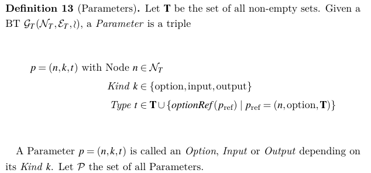
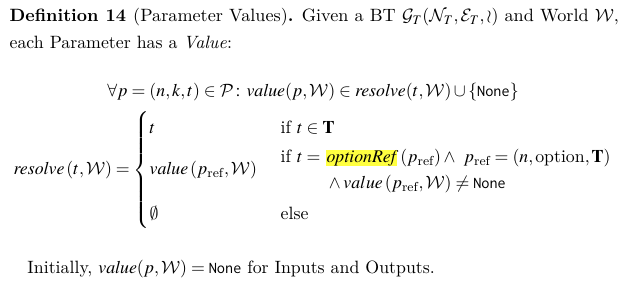
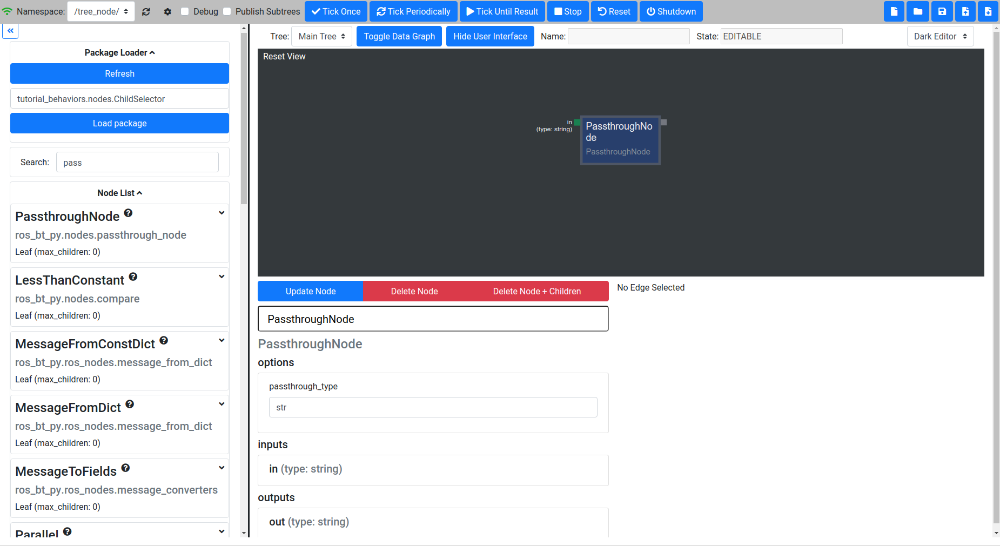

.. _advanced-tutorial:

#################
Advanced Tutorial
#################

In this Tutorial more advanced concepts are introduced.

****************
Using OptionRefs
****************

As you have seen there are nodes like the constant node that can change the types of their
Parameters (Options, Inputs and Outputs are collectively called Parameters).

While bt_py uses only strongly typed parameters, we might want to edit them during three creation
instead of while defining Node Classes.

To understand how this is done, it is helpful to take a look at the formal definition:

The Type t of a Parameter can be either a set from T that contains the legal values for the
Parameter to take (like N or the set of all valid Python str objects), or a Reference to an Option.
In the latter case, p_ref is required to have the form (n, option, T), where T is, again, the set
of all the sets that can be used as values for the Type t.
In particular, as T only contains sets, it does not include References, so cyclic References are
not possible.

So a parameter can either be defined with a given Type (as we did in the earlier examples) or by
providing a reference to an option.
Thee parameter value is defined in the referenced parameter type:

The Values of Options are static, so their initial Values are their only Values and are defined
separately.
In practice, Option Values are supplied as a dictionary to the constructor of a Node.
Static, in this case, does not mean that it can not be changed in the overall BT, but not during
runtime.
So while the "Constant" Node can be parameterized with various constants during construction of the
tree in the editor, it will not change this value during runtime.

Defining OptionRefs in the NodeConfig
=====================================

Lets look at an example:

.. code-block:: python

   @define_bt_node(NodeConfig(
        options ={ ' passthrough_type ': type },
        inputs ={ ' in ': OptionRef ( ' passthrough_type ')} ,
        outputs ={ ' out ': OptionRef ( ' passthrough_type ')} ,
        max_children =0))
   class PassthroughNode ( Leaf ):
       """
       Pass through a piece of data
       Useful for testing , and to mark the inputs of
       a BT that is meant to be loaded as a subtree .
       """
   # implementation ...

The PassthroughNode defines option "passthrough_type" which is set by the user while instantiating
the node.
Its Inputs ("in") and Outputs ("out") respectively are defined as OptionRef('passthrough_type')
which will be resolved to the given type at runtime.

Here is what this looks like:

Note that you need to update the node and then reload the paramter view by closing and opening it
again for the changes to show.
By default the PassthroughNode initializes to int.
Change this to string by entering "str" as type and then select "Update Node"
