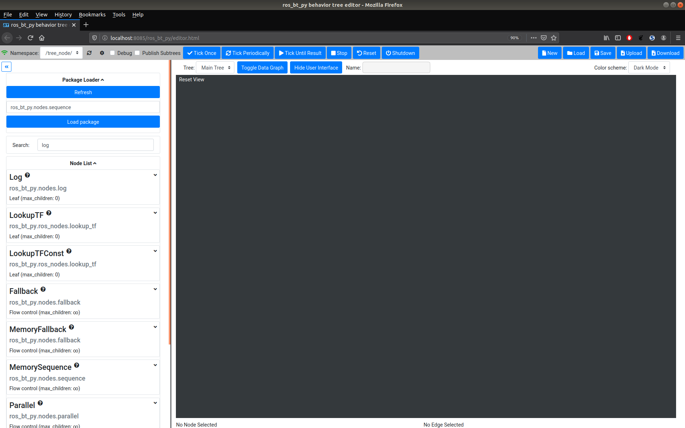
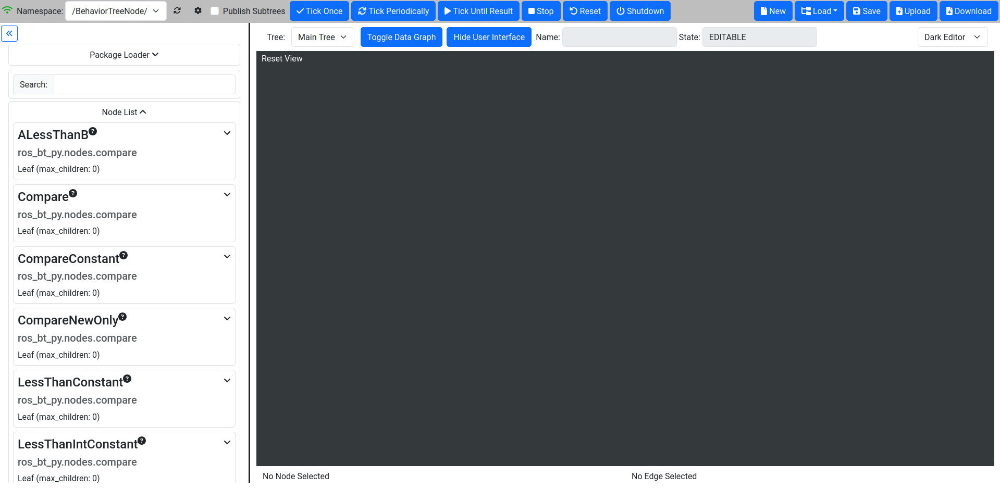
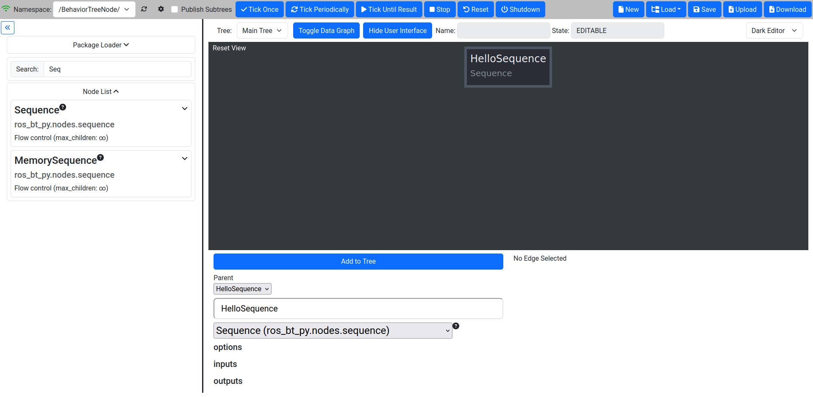
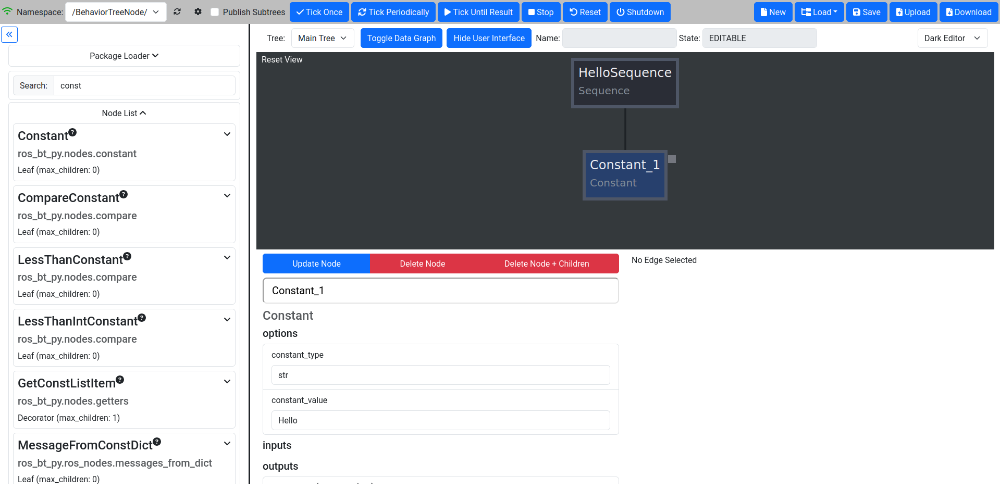
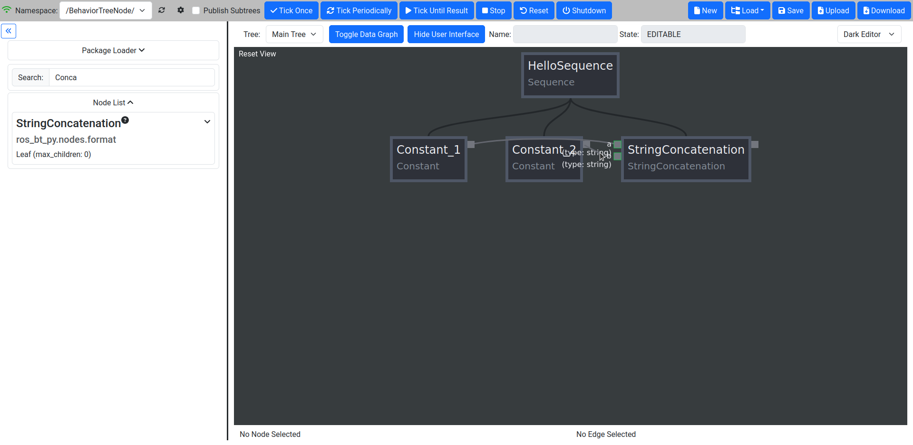
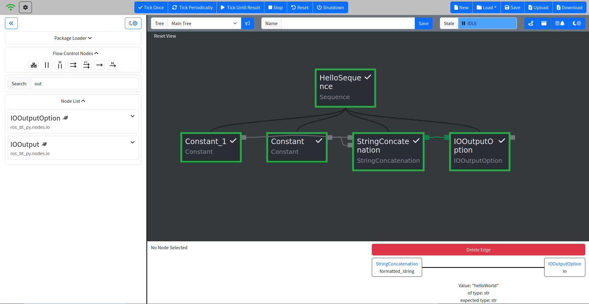
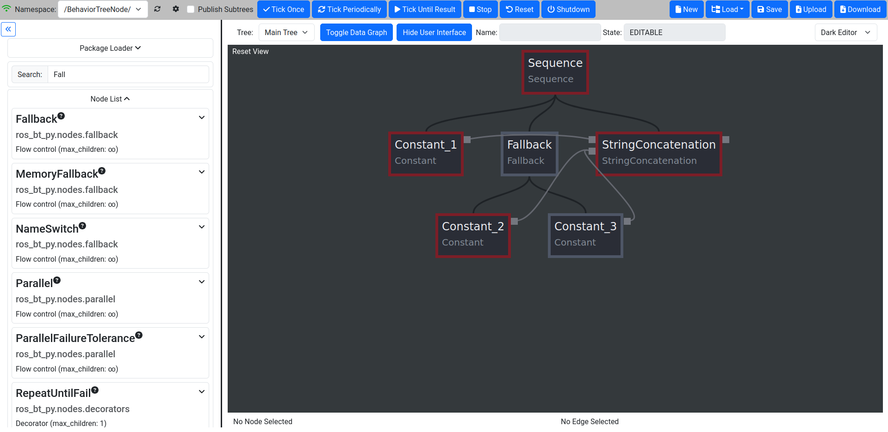
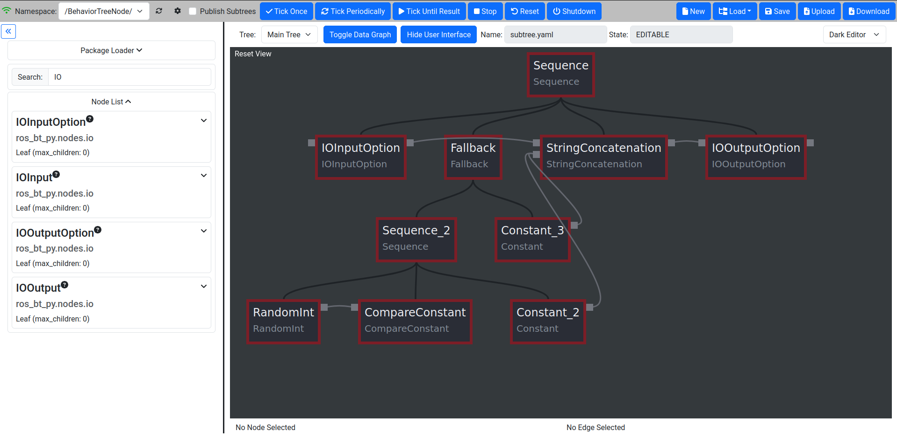

.. _basic-tutorial:

##############
Basic Tutorial
##############

*********************
Starting up ros_bt_py
*********************

To get started launch the library in a sourced shell by running

.. code-block:: bash

  ros2 launch ros_bt_py ros_bt_py.launch.py

***********************
Examining the Interface
***********************

Then you can open a browser and go to http://localhost:8085/index.html to open the BT Editor which
should look like this:

The interface consists of four major parts: The Top Menu Bar, a Package Loader, the Node List and
the large Editor Window.

Menu Bars
=========

On the top of the GUI there are two menu bars, the Top Bar for general control as well as a Support
Bar below that.
The Top Menu Bar contains (from left to right):

* An indicator to show that the editor is connected to a behavior tree instance
* A dropdown menu to select which ROS namespace to monitor (you can run multiple behavior trees in
  different namespaces)
* A refresh button
* A special config button to change the address of the rosbridge server
* Options to enable publishing of subtree data making it easier to monitor complex trees.
* Buttons to control the execution of the currently loaded BT.
* Buttons to load a BT from, or save it to, a ROS package.
* Buttons to upload a BT YAML to the editor or download the YAML of the currently loaded BT

The Support Bar contains:

* A Tree selection window to select the displayed tree, especially useful when using Subtrees.
* Toggle Buttons for the Data Graph (more on that later) and the GUI itself if you want a
  fullscreen view.
* The Name field, which is not really useful???? TODO: Fix?
* The State Field showing the state of the tree, also more on that later.

Package Loader
==============

The Package Loader can be used to load additional Node Classes for use.
To load a new package enter the qualified path of the Python module that contains them and
click the Load Package button.
The Node Classes in the loaded module should now show up in the Node List.
Using the package loader is recommended for Node Class development, while building trees with custom
nodes loading Node Classes through :ref:`an advanced launch config<advanced-launch-config>` is
recommended to save time.

Node List
=========

Below the Package Loader a List of all currently available nodes can be found.
The search window on top of the list can be used to restrict the list of displayed nodes.
The search is applied to the node names as well as the node package name.
By hovering over the question mark a detailed Node Class description can be accessed.
Left-clicking on a Node Class selects it for insertion into the BT through the Node Menu.
The node can also be dragged into the Editor Window to directly place it into the BT.

Editor Window
=============

The editor canvas shows the currently loaded BT.
While running a tree the editor always shows the state of the tree nodes and can be used for
debugging.
While editing the nodes in the canvas can be dragged around and rearranged freely.

Node Menu
=========

.. image:: _static/gui_node_menu.png
   :alt: GUI with active Node Menu

When a node in the tree is selected the Node Menu for that node appears.
Here the node itself can be configured or deleted and both the Node Options as well as its Inputs
and Outputs are shown.
When selecting a node during execution the current In- and Outputs can be seen through the Node
Menu.
While interacting with Edges they can also be deleted in the Node Menu.

*********************
Writing your first BT
*********************

Before we get into the gritty details of BTs let's write a first, very basic, tree.
If you want to learn about the details first you can also come back to this section later.

1. Make sure the Tree is not currently running
==============================================

To compose a BT, the tree must not currently be in the RUNNING state.
It is easiest to ensure this by clicking the Shutdown button on the top.

#. Click "Shutdown" once and make sure the State Field shows "EDITABLE"

2. Add a control flow node
==========================

To start building the BT, you will have to add nodes from the Node List on the left.
It is common to start by adding a Sequence or Fallback node as the root of the BT.

#. Type "sequence" into the search box and click the Sequence node.
#. Customize the node’s name by setting it to "HelloSequeunce".
#. Add it to the BT by clicking the "Add to Tree" button.

3. Add a leaf node to the tree
==============================

Now we add leaf nodes to the Sequence to actually make the tree do something

#. Type "const" into the Search Box.
#. Drag Constant from the node list and drag it into the dark rectangle below the "HelloSequence"
   node.

.. image:: _static/first_tree_2.png
  :alt: GUI with Sequence while Constant is added

4. Modify the Constant node
===========================

After adding the node to the tree it needs to be adjusted to to what we want it to.

#. Click on the Constant node in the canvas that was just added.
#. Change the Name to "Constant_1".
#. Change the constant_type to "str" (this will automatically be expanded to "builtin.str").
#. Change the constant_value to "hello".
#. Press update node to commit the changes.
#. The canvas and properties will be updated.

5. Add a second Constant and a processing step
==============================================

One Constant is nice, but it can't do a lot by itself.

First we add another Constant node:

#. Add another constant node by dragging it to the right of the first one.
#. Change its type to string and set the name value to "World".

#. Search for "Concat" in the Search Box and select StringConcatenation by dragging it to the
   right of the constants.

6. Connecting the Data Wirings
==============================

Inputs and Outputs of all nodes in the tree are marked as gray squares adjacent to the nodes in
the Editor Window.
When hovering over the little dot on the Constant Nodes you should see the output type.
Data Wirings are created by simply clicking and dragging from an Input to an Output of the same
type or vice versa.
Compatible Inputs or Outputs are highlighted while dragging, as shown in the picture below.

#. Connect the Outputs of the Constants to the processing node.

7. Run the finished tree
========================

After creating a tree we need to run it to verify our work.
When the tree is finished we should see the "StringConcatenation" node Output being "HelloWorld".
A successful run of the tree is indicated by the State Field displaying "IDLE".

#. Run the Tree by pressing "Tick Until Result".
#. Make sure the State Field is displaying "IDLE".
#. Click the "StringConcatenation" node to verify Inputs and Output in the Node Menu.

******************
Working with bt_py
******************

While working with bt_py it is important to understand both the tree structure created by the
arrangements of different nodes as well, the Data Graph used to share information between the
nodes as well as the control of the tree in general.
This section will give an overview of the processing of a BT, the Node Class Types that are
available, how to use them effectively and all you need to know about the Data Graph.

Tree Execution
==============

Before we talk about the building blocks of a BT in more detail a short introduction to the actual
tree execution is needed to understand the effect of e.g. different Flow Control Node Classes in the
next sections.

Ticking
-------

Traversal through the tree is done by "ticking" the tree.
On Tick the node that is currently next in line will receive a tick command and execute its internal
"do_tick" method.
This can lead to a multitude of results depending on the Node Class of the ticked node.
In a standard configuration bt_py is trying to tick at a rate of 10 Hz.

Tree States
-----------

To check the health of your tree and determine your next steps e.g. on a successful run of the tree
you need to understand the different Tree States as shown in the State Field

* **EDITABLE:**
  The tree is currently not running and changes can be made in the canvas.
* **RUNNING:**
  The tree is currently running and no changes can be made.
  Everything is great.
* **IDLE:**
  The tree reached a terminal state, but you will have to call Shutdown before you are able to edit
  it.
* **ERROR:**
  The tree reached an error state while executing.
  Something went wrong - find the bug.

Execution modes
---------------

When running a tree the Top Bar gives you multiple execution modes to choose from:

* **Tick Once:**
  Run exactly one single Tick through the tree.
  Especially useful when trying to debug a faulty tree.
* **Tick Periodically:**
  Run Ticks until Shutdown is called.
  After a successful run the tree will reset and start again instead of going into the IDLE state.
* **Tick Until Result:**
  Run Ticks until Shutdown is called or the tree transitions into the IDLE state.
* **Stop:**
  TODO: Does this do something?
* **Reset:**
  Reset the tree.
  This will not change the Tree State and should only be called while IDLE.
  Data in the tree as well as the Node States of the tree nodes will be reset.
* **Shutdown:**
  Halt and shut down the tree completely.
  This is your get out of jail free card.
  Use this to get into EDITABLE to edit your tree from any other Tree State.

Nodes
=====

Nodes are the backbone of each tree, creating the control flow in the BT as well as actually doing
something.
Every Node belongs to a Node Class, determining what the Node will do when it gets ticked.
Additionally each node is assigned a Node State, representing its current condition and defining the
behavior the Node will display when ticked.

Node States
-----------

Node States are shown by a color coded frame which can be used to visually debug a tree during
runtime.
Additionally Node States can affect the flow of the tree and which nodes are ticked through Flow
Control Nodes.

* **UNINITIALIZED:**
  An uninitialized node is a node in a tree that has not been executed.
  The node will have a gray frame while being in this state.
  When ticking any node in a tree all uninitialized nodes will transition to IDLE.
* **IDLE:**
  An idle node has not yet been ticked, but is ready to be ticked.
  The node will have a light blue frame while being in this state.
  Calling Reset will reset all nodes in the tree to IDLE.
* **SUCCEEDED:**
  A succeeded node has reached its terminal state and its action was successful.
  The node will have a light green frame while being in this state.
* **FAILED:**
  A failed node has reached its terminal state and its action failed.
  The node will have a light red frame while being in this state.
  Failing does not mean something went wrong!
* **BROKEN:**
  A broken node has encountered an error while executing and will set the Tree State to ERROR.
  The node will have a dark red frame while being in this state.
  Broken nodes mean something is wrong - most probably in your node implementation.
* **SHUTDOWN:**
  A shut down node means Shutdown was called on the whole tree and all nodes should be in that
  state.
  The node will have a dark red frame, similar to the BROKEN state.

Node Class Types
----------------

Node Classes are grouped into three Types: Flow Control, Decorator and Leaf nodes.
Types are defined by their allowed number of Child Nodes (Nodes that are below the respective node
in the tree) which underlines their intended usage.

* Flow Control Nodes are allowed to have an unlimited amount of Child Nodes.
  They are used to control the general execution of the tree and create the structure of the tree.
* Decorator Nodes are allowed to have exactly one Child Node.
  They are used to apply conditions to this single child, such as ignoring its terminal state or
  repeating the execution.
* Leaf Nodes are the nodes that actually do something, such as providing or processing data.

Data Graph
==========

To distribute data between nodes bt_py uses a Data Graph instead of a blackboard implementation as
it is used in bt_cpp and other implementations.

This means that data needs to be explicitly wired between Inputs and Outputs of the individual
nodes, but you don't need to worry about which entries are in your blackboard at a certain time.

To wire Data draw a graph edge from an input to an output or vice versa.
While both Inputs and Outputs can have multiple connections at the same time, allowing for complex
information flow in the tree, Inputs need to have at least one connection for the tree to start
execution, as ticking a node without a set Input would lead to undefined behavior.
Outputs do not need to have a connection and can be left empty.

Output values are only sent through the Data Graph when the node they are attached to is ticked, so
make sure that your control flow takes that into account.

Input and Output data types need to match when creating an edge, which can lead to problems when
changing Node Classes for already connected trees.
To ensure easy tree manipulation delete edges from nodes before changing the node or the Node Class
implementation.

Working with larger trees
=========================

As soon as there is more than one Node in the BT, Nodes can be moved via drag & drop.
While dragging a Node, translucent drop targets appear at the positions it can be moved to.
The canvas can be scrolled freely, either by clicking and dragging on the background or by moving
the cursor close to one of its corners while dragging a Node or Wiring.

**************************
Understanding Flow Control
**************************

Flow Control Nodes are integral to effective BT design which is why we will explain them in more
detail.
For understanding Leaf and Decorator Node Classes please refer to the docs.

Basic Control Flows
===================

The most basic Control Flow Nodes you will use the most are Sequences and Fallback nodes.

**Sequences** are ticked until all their Child Nodes returns success, making them suitable for
linear action sequences you want the tree to trigger, such as getting a goal and driving to the goalwith your robot.
They will return FAILED as soon as one child fails.

**Fallbacks** are ticked until one(!) of their Child Nodes returns success, making them suitable for
basic branching of different behaviors, such as deciding on which action to take first when multiple
actions might be suitable in the current situation.
They will only return FAILED if all children fail.

Advanced Control Flows
======================

While Fallbacks and Sequences are great for designing a BT, sometimes more complex Flow Control is
needed.

**Name Switches** are used for targeted selection of action paths, ticking only the Child Node whose
name matches the Input of the Name Switch and will return the terminal state of that child.

**Parallel** nodes are used to trigger multiple Child Nodes at the same time, enabling parallel
behaviors.
Child Nodes are ticked until they reach a terminal state and will not be ticked again until all
children return a result.
The return value of the Parallel node is determined by the amount of successes needed which can be
configured in the Node Menu.
While the amount of allowed failures of a bare Parallel node is implicitly given by the amount of
successes needed a **ParallelFailureTolerance** allows for more flexibility by explicitly defining
the amount of allowed failures.

Regarding Memory
================

As you might have noticed by now, both Fallback and Sequence Node Classes are also available in two
versions, one basic and one memory version.
While the behavior of those nodes is the same when all nodes in the BT return their results on their
first tick, it is vastly different when looking into longer running behaviors - such as moving your
robot to a goal pose/point.

The basic implementations of the Node Classes will *untick* all their Child Nodes as soon as one
child returns RUNNING.
This is awesome when trying to create a reactive behavior, but will lead to weird and unwanted
effects if we actually want to give the system the time to finish a behavior e.g. a movement.

To avoid those effects, such as the longer running behavior to be triggered multiple times, both
**Memory Sequence** and **MemoryFallback** nodes can be used.
They will remember the state of their Child Nodes when being ticked again after a node returned
RUNNING and in turn continue ticking that node until it reaches a terminal state.

In general you will want to mostly use the memory version of the basic Flow Control Node Classes
when writing BTs for robotic applications and only use the basic versions when you explicitly want
to display reactive behaviors.

*************************
Writing a more complex BT
*************************

Using the knowledge we gained about more complex Control Flows we now want to modify our tree that
we created earlier to outputs either "HelloWorld" or "HelloRobot" randomly instead of a boring
"HelloWorld".

Starting from our basic tree we need to introduce a branching path through the tree where one path
sets the Input "b" of the "StringConcatenation" to "Hello" and the other sets it to "World".

1. Adding a branching path
==========================

Looking at the Flow Control Nodes both a Fallback as well as a Name Switch Node seem feasible, but
for now we choose to use a Fallback as it is the more often used node.
Additionally we add a third Constant "Constant_3" containing the string "Robot".

#. Drag and Drop a Fallback Node before the StringConcatenation node.
#. Drag the Constant_2 node below that Fallback node.
#. Drag and Drop an additional Constant node to the right of the Constant_2 and adjust the Constant
   type and value - it will automatically be named Constant_3!

If you run the tree you will observe that the output is always the same, as we did not yet introduce
a way for the first child of the Fallback to fail, creating a situation where the first child will
always succeed and the second child to never be ticked.

2. Introducing randomized Outputs
=================================

Next we want to introduce the random output - Luckily bt_py has a native **RandomInt** Node Class
allowing for easy introduction of a random variable as well as a **CompareConstant** Node Class for
checking our number.

Before adding the node let's first think about where to do the random number generation and the
tree flow we want to generate.
Just adding the nodes directly under the Fallback will result in an Error state - the RandomInt node
will succeed, letting the Fallback succeed and the StringConcatenation node being ticked with one
unset input!
Clearly the random number check needs to happen in its own Sequence and one of the Constants needs
to be ticked if the check succeeds.
So let's introduce a Sequence that takes care of this.

#. Drag and Drop a Sequence node below the Fallback left of Constant_2.
#. Drag and Drop a RandomInt node and a CompareConstant node below the sequence.
   Also Drag the Constant_2 node to the right of them.
#. Adjust the *max* Option in the Node Menu of the RandomInt node to 1 - this will make the node
   generate either 0 or 1.
#. Check the expected type and value of the CompareConstant node to make sure it will compare an int
   to either 0 or 1 - your choice.

.. image:: _static/second_tree_1.png
  :alt: Added random element

When running the tree through "TickUntilResult" multiple times and examining the Node Data you will
see that only Constant_2 or Constant_3 is ticked, depending on the generated number.

Randomizing the number at the beginning of the tree does work as well, but trying to keep
information locally helps with making the tree more understandable!

**************
Using Subtrees
**************

When creating large trees both Data Wiring as well as Tree Structure can quickly get unwieldy.
Additionally you should try to reuse behaviors as much as possible - no need to create the same tree
section multiple times.

To solve those problems bt_py provides Subtrees as a way to reduce redundancy and make it possible
to quickly insert complex behaviors in multiple sections of one large tree while keeping the tree
itself well structured.

Inside the top level tree the Subtree is represented as a single node of the Subtree Node Class.
To load a specific tree you will need to provide the path to the tree inside the Subtree Node
Options.
Note that the path can either be an absolute path, in which case you should lead with `file://` as
well as a path relative to a ROS 2 package, in which case you should lead with `package://`.

Subtree I/O
===========

While regular Node Classes usually have predefined Inputs/Outputs (except the ROS Interface Node
Classes we will discuss shortly), Subtree nodes need to generate them automatically from the actual
tree definition.

You can define Inputs/Outputs *implicitly* or *explicitly*.

*Implicit* definition is the one exception to the rule of unconnected Inputs as it requires you to
leave the Inputs you want to set from outside the Subtree to be empty.
When unchecking the "use_io_nodes" Option in the Subtree Node Menu unconnected In- and Outputs will
be set to the Subtree In-/Outputs respectively.
**This might cause the BT that is used as a Subtree not to be executable as a standalone tree,
making them hard to verify!**

*Explicit* definition makes use of **IOInput** and **IOOutput** Node Classes as well as their
**Option** versions.
These Node Classes have a default value for the Subtree In-/Output, either as an Option or an
Input, allowing for standalone execution and testing.

Using a Subtree in our example tree
====================================

Let's say we want to use our randomized string inside a larger tree, where we define the first part
of the tree. But we also want to be able to still execute our "HelloWorld/Robot" example by itself!

1. Define Inputs and Outputs
----------------------------

Using what we learned before, we should utilize the tree as a Subtree, while explicitly defining
tree Inputs and Outputs to keep the tree executable as a standalone tree.

#. Drag and Drop an IOInputOption as well as an IOOutputOption node at the start and end of the
   main tree sequence.
#. Adjust the Data Types and default values. The default value of the Input should be "Hello",
   the one of the Output is not important as we always set an input.
#. Connect the Data Graph and delete the Constant_1 node - it has been substituted by the
   IOOutputOption.
#. Test the tree. The Output of the IOOutputOption node should be the same as before.

2. Utilize the tree as a Subtree
--------------------------------

Now we are ready to use the tree as a Subtree where we manipulate the first part of our output
string.

#. After saving our first tree (let's call it "subtree.yaml") open a blank tree by clicking "New".
#. Create a new Sequence with a Constant and a Subtree.
#. Load the Subtree we just saved by adjusting the path Option of the Subtree node.
   Use `file:///path/to/dir/subtree.yaml`.
#. Adjust the Constant to output "Goodbye" and connect the In-/Outputs.
#. Verify the Output of the Subtree, it should read "GoodbyeWorld" or "GoodbyeRobot", depending on
   what was rolled in the Subtree.

.. image:: _static/third_tree_1.png
   :alt: Used as Subtree

***********************************
Using ROS Interfaces with ros_bt_py
***********************************
